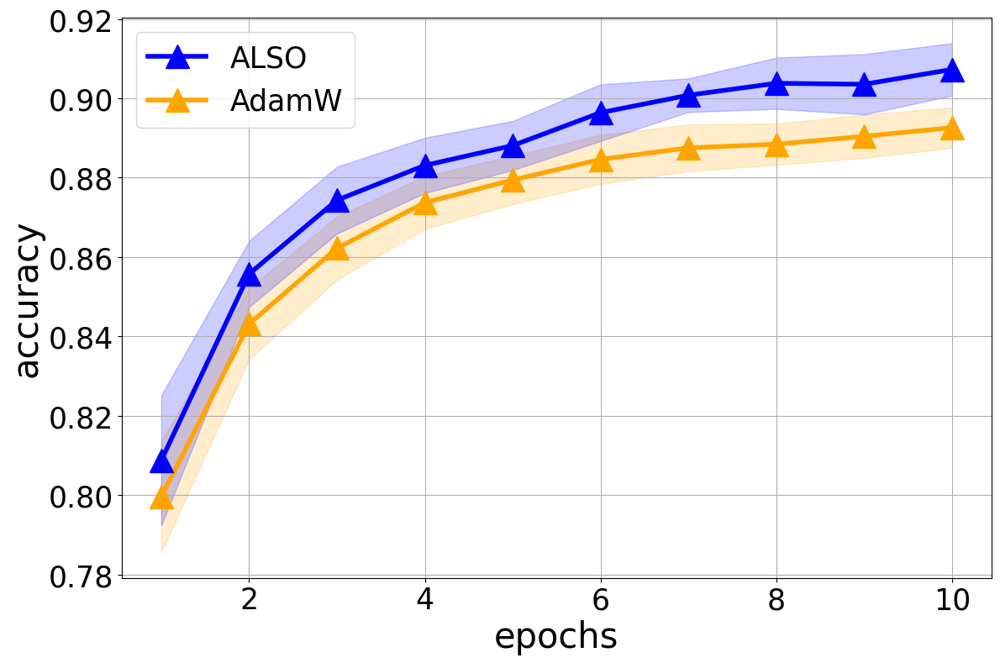

## Adversarial attaks 

The purpose of this experiment (./checkpoints/exp_1) is to maximize quality:

$$
    \text{Accuracy} = \frac{1}{m} \sum_{i=1}^m \text{Accuracy}(\text{Attack}_i)
$$

We train pretrained CNN on the attacked MNIST with different torchvision transforms and FGSM attack.

We compare ALSO and AdamW pipeline. We slightly changed
the pipeline of the ALSO algorithm, namely, at each iteration k we sample the index i ∼ Cat(πk), that correspond i-th attack. During
Adam training we sample i from uniform distribution.

Experiments show that ALSO has an advantage, which can be explained by the fact that by allocating large weights
to the most difficult attacks, the model learns them with a higher priority, but at the same time the simplest attacks the model has already learned and their quality grows insignificantly. That is, we maximize the worst qualities, which makes the average quality better.

The results of the experiment can be summarised by this plot:

## How use lib

1. Check examples in demo: all_attacks.ipynb

